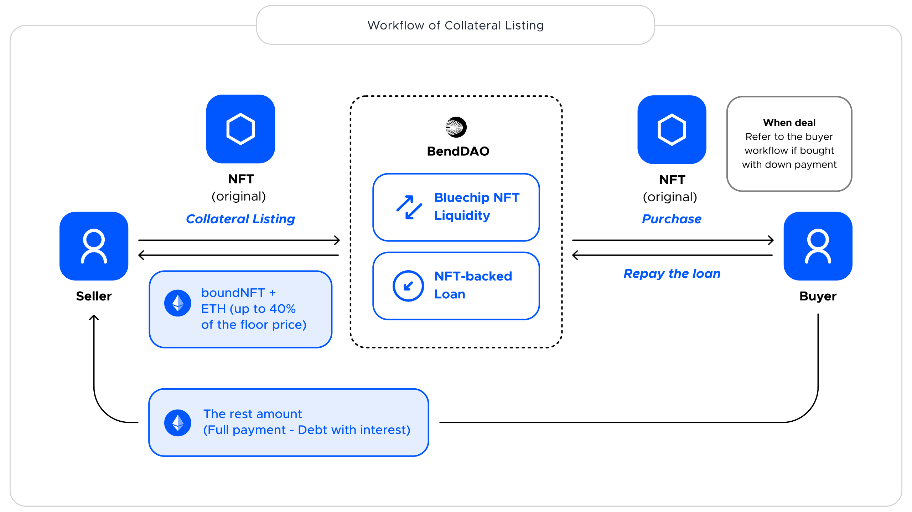

# NFT Liquidity

Based on the [instant NFT-backed loan](instant-lending-and-repayments.md), Collateral Listing becomes possible for NFT players.&#x20;

## From sellers' perspective

### Collateral Listing

With Collateral Listing, NFT holders/sellers can choose to take an instant NFT-backed loan and receive up to 60% of the floor price instantly when listing. If you already are a borrower on BendDAO, then you can list the collateral anytime you like.&#x20;

The user will become the borrower and the seller on BendDAO after the Collateral Listing.

## From buyers' perspective

### NFT Down Payment

The buyer can pay **a minimum down payment of 40%**, depending on the actual price, to buy a bluechip NFT while initiating a flash loan from AAVE to cover the remainder. The borrowed amount of the flash loan will be repaid through the instant NFT-backed loan on BendDAO.

The buyers will automatically become borrowers with the down payment. And borrowers can list their mortgaged NFT for sale as well.

.png>)

### [nft-down-payment-buyer.md](../nft-liquidity/nft-down-payment-buyer.md "mention")

### [FAQ](../faq/down-payment-faq.md)
