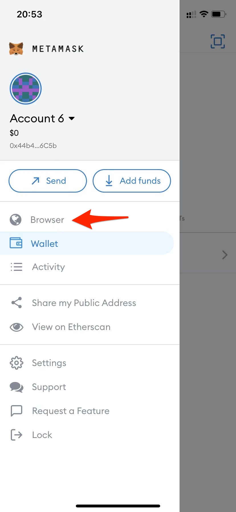
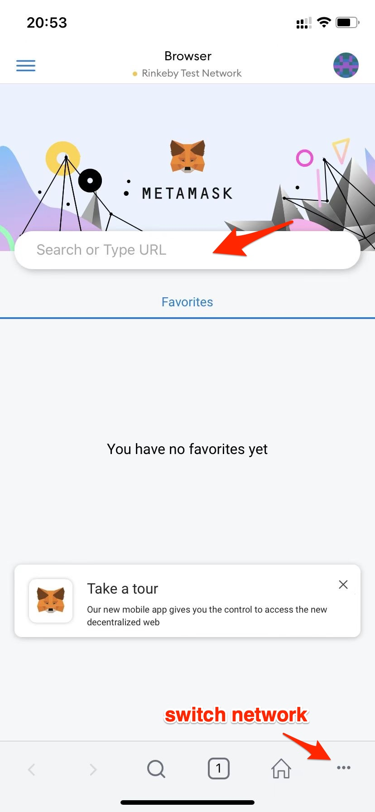
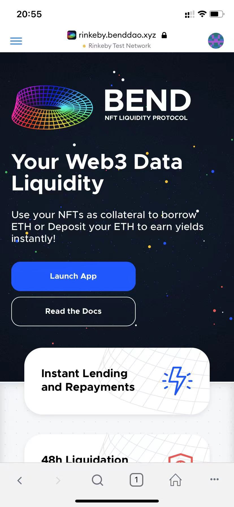

# BEND on Mobile

For a better experience on Android/IOS mobile devices, we recommend using the MetaMask built-in browser.

## Installing MetaMask

1.Install MetaMask mobile at [MetaMask.io](https://metamask.io).

2.Open the MetaMask mobile app.

3.If you want import exist accounts from your desktop MetaMask wallet, please select 'Sync or Import' > 'Scan QR code', and follow MetaMask guides.

4.If you want create new accounts, follow MetaMask guides.

## Using BEND

1.Open builtin Browser in MetaMask.

2.Input BEND website URL.

Mainnet: [https://www.benddao.xyz/](https://www.benddao.xyz)

Rinkeby: [https://rinkeby.benddao.xyz](https://rinkeby.benddao.xyz)

3.Let us experience BEND.

